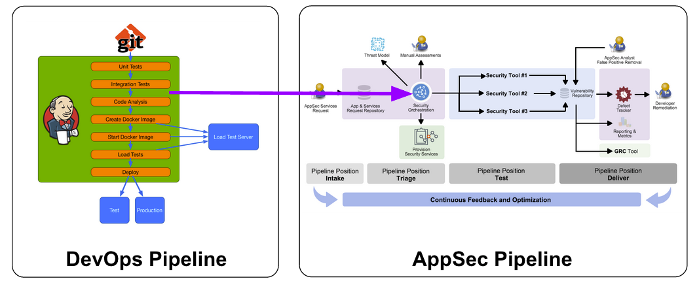

Welcome to DevSecOps Studio Project
===================

[](https://travis-ci.org/hysnsec/DevSecOps-Studio)

DevSecOps Studio is one of its kind, self contained DevSecOps environment/distribution to help individuals in learning DevSecOps concepts. It takes lots of efforts to setup the environment for training/demos and more often, its error prone when done manually. DevSecOps Studio is easy to get started, mostly automatic and battle tested during our Practical DevSecOps Courses at https://www.practical-devsecops.com/courses-and-certifications/

DevSecOps Studio project aims to reduce the time to bootstrap the environment and help you in concentrating on learning/teaching DevSecOps practices with the following features.

1. Easy to setup environment with just one command “vagrant up”
2. Teaches Security as Code, Compliance as Code, Infrastructure as Code
3. With built-in support for CI/CD pipeline
4. OS hardening using ansible
5. Compliance as code using Inspec
6. QA security using ZAP, BDD-Security and Gauntlt
7. Static tools like bandit, brakeman, windbags, gitrob, gitsecrets
8. Security Monitoring using ELK stack. 

## How do I get set up? ###

* [Summary of setup](#summary-of-setup)
	* [Software](#software)
	* [Hardware](#hardware)
* [Dependencies](#dependencies)
	* [Mac OS X](#macos-optional)
	* [Linux](#linux)
	* [Windows](#windows-optional)
* [DevSecOps Studio Installation](#installation)
* [What's included in the environment](#whats-included-in-the-environment)
* [How to use the setup](#how-to-use-the-setup)
* [Todo Features](#todo-features)
* [Contribution guidelines](#contribution-guidelines)
* [Who do I talk to?](#who-do-i-talk-to)


## Summary of Setup
### TL;DR

Install [Vagrant](https://www.vagrantup.com/downloads.html), [Virtualbox](https://www.virtualbox.org/wiki/Downloads), [Ansible](http://docs.ansible.com/ansible/latest/intro_installation.html#installation) and Follow the below steps.

```bash
# Download the code
$ git clone https://github.com/hysnsec/DevSecOps-Studio.git && cd DevSecOps-Studio

# Download the ansible dependency roles
$ ansible-galaxy install -r requirements.yml -p provisioning/roles

# Setup the environment, takes an hour or less based on your internet speed.
$ vagrant up
```


Go grab some coffee while DevSecOps Studio does its job.

Yes, that's it, you just setup entire DevSecOps environment with three commands :)


Go ahead and read Practical DevSecOps Lessons on the [wiki](https://github.com/hysnsec/DevSecOps-Studio/wiki)

### Installation video
[](https://asciinema.org/a/LGCa3te9yXhVLDCRpL2TtxzHa)

### Details

DevSecOps Studio uses `vagrant`, `virtualbox` and `ansible` to setup the lab environment. You can visit the vendor's website to download the above software for on Windows/Linux/macOS.

DevSecOps Studio simulates the environment presented below.



### Software

* [Vagrant](https://www.vagrantup.com/downloads.html)
* [Virtualbox](https://www.virtualbox.org/wiki/Downloads)
* [Ansible](http://docs.ansible.com/ansible/latest/intro_installation.html#installation)

### Hardware
* Atleast 4GB of RAM for the virtual machines.
* 60GB of HDD Space.
* Intel i3 Processor or above.

## Dependencies

### MacOS (optional)

Prerequisites can also be installed via homebrew on MAC OS X

[Homebrew](http://brew.sh/): Optional

```bash
 /usr/bin/ruby -e "$(curl -fsSL https://raw.githubusercontent.com/Homebrew/install/master/install)"

```

[Vagrant](https://www.vagrantup.com/downloads.html)

```bash
brew cask install vagrant
```

[Virtualbox](https://www.virtualbox.org/wiki/Downloads)

```bash
brew cask install virtualbox
```

[Ansible](http://docs.ansible.com/ansible/latest/intro_installation.html#installation)

``` bash
brew install ansible
```

### Linux

Curl Installlation(require root privileges to install tools)

``` bash
curl -O https://raw.githubusercontent.com/hysnsec/DevSecOps-Studio/master/setup/Linux_DevSecOps_Setup.sh && chmod +x Linux_DevSecOps_Setup.sh && ./Linux_DevSecOps_Setup.sh;
```

or 

Install dependencies using apt-get

[Virtualbox](https://www.virtualbox.org/wiki/Downloads)

``` bash
sudo sh -c 'echo "deb http://download.virtualbox.org/virtualbox/debian xenial contrib" >> /etc/apt/sources.list.d/virtualbox.list'

wget -q https://www.virtualbox.org/download/oracle_vbox_2016.asc -O- | sudo apt-key add -

sudo apt update

sudo apt install virtualbox
```
[Vagrant](https://www.vagrantup.com/downloads.html)

``` bash
# Looks like vagrant doesn't play nicely if you install with apt
VAGRANT_VERSION=2.2.1
wget https://releases.hashicorp.com/vagrant/${VAGRANT_VERSION}/vagrant_${VAGRANT_VERSION}_x86_64.deb
sudo dpkg -i vagrant_${VAGRANT_VERSION}_x86_64.deb

sudo apt-get install python3 python3-pip
```
[Ansible](http://docs.ansible.com/ansible/latest/intro_installation.html#installation)

``` bash
pip install ansible
```

### Windows (optional)

Easiest solution for windows user is to use DevSecOps Studio Virtualbox Appliance
1. Download DevSecOps-Studio Appliance (4.45 GB) from this link - __REMOVED__.

2. Import the above Appliance by following [these step](https://docs.oracle.com/cd/E26217_01/E26796/html/qs-import-vm.html)


Alternatively, Installation can be done using [chocolatey](https://chocolatey.org/install) by opening up command prompt  and using the following command.

```bash
@"%SystemRoot%\System32\WindowsPowerShell\v1.0\powershell.exe" -NoProfile -InputFormat None -ExecutionPolicy Bypass -Command "iex ((New-Object System.Net.WebClient).DownloadString('https://chocolatey.org/install.ps1'))" && SET "PATH=%PATH%;%ALLUSERSPROFILE%\chocolatey\bin"
```

Install dependencies using choco

```bash
choco install vagrant virtualbox git -y 
```


Install ansible via pip  
> Installation on windows for ansible is not straight forward, please follow [these instructions](https://www.jeffgeerling.com/blog/running-ansible-within-windows) to install cygwin and then install ansible

```bash
choco install python3 -y #Installs python 3, includes pip under scripts folder of python3x
pip install ansible
```

## Installation

1. Clone this repo or download the zip

	```bash
	$ git clone https://github.com/hysnsec/DevSecOps-Studio.git
	```

1. CD into the directory and check what boxes are available.

	```bash
	$ cd DevSecOps-Studio && vagrant status
	```
2. Download requirement ansible dependencies.
    ```bash
    $ ansible-galaxy install -r requirements.yml
    ```
3. Ensure the latest verion of Vagrant is installed on your machine 
4. Edit the machines.yml file to make any changes, if you are not sure please leave it as default. Meanwhile, go grab some coffee to enjoy :)

	```bash
	vagrant up
	```
You can see how it all fits in DevSecOps pipeline by reading out [WIKI](https://github.com/hysnsec/DevSecOps-Studio/wiki)

## How to use the setup

## What's included in the environment?

The environment contains the following tools used in different stages of DevSecOps.


 Technology  | Tools
------------ | -------------
PenTest Toolkit: | Nmap, Metasploit
Static Analysis Tools: | Brakeman, bandit, findbugs
Dynamic Analysis Tools: | ZAP proxy, Gaunlt
Hardening: | DevSec Ansible OS Hardening
Compliance: | Inspec
Operating System :| Ubuntu Xenial (16.04)
Programming Languages: | Java, Python 3, Ruby/Rails
Container Technology:| Docker
Source Code Management:| Gitlab (github like system)
CI Server:| Gitlab CI/Jenkins
Configuration Management:| Ansible
Monitoring and Log management:| Elastic Search, LogStash and Kibana
Cloud Provider Utilities:| AWS CLI
Utilities:| Git, Vim, curl, wget,


## Todo Features

- [ ] Provision the stack on AWS using vagrant.
- [ ] Build Images using Packer and upload to vagrant cloud.
- [x] Add Ansible Testing using molecule.
- [ ] Add Container scanning using clair.
- [x] Add Inspec for compliance.

## Contribution guidelines

* Fork this repo.
* Contribute (documentation/features)
* Raise a Pull Request (PR)

## Credits

DevSecOps Studio uses some of the ansible roles from [Jeff](https://github.com/geerlingguy)

## Who do I talk to?

* If you have any questions regarding this repo, please contact Mohammed A. Imran @secfigo and Raghunath G @raghunath24
